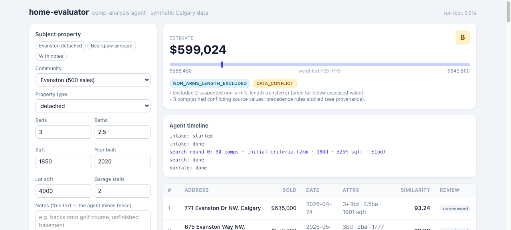
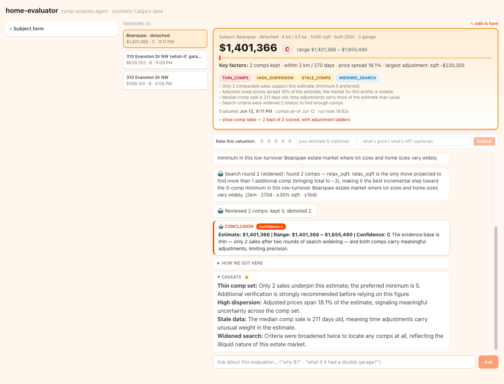
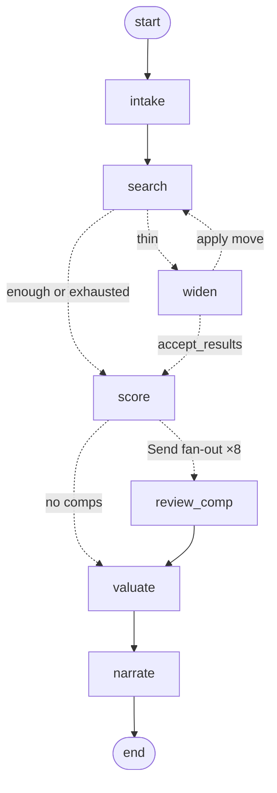

# home-evaluator — comp-analysis agent

An AI agent that does residential comp analysis the way a lender needs it done: it
searches multi-source sales data, ranks comparables with auditable math, reviews each
comp with LLM judgment, produces a valuation estimate with a confidence grade and risk
flags, and explains its reasoning appraiser-style — live, in a streaming UI.

Built for the KV Capital AI Engineer hackathon. **≤3-min demo video: _link goes here_.**

| Normal market (Evanston) | Thin market (Bearspaw acreage) |
|---|---|
|  |  |

## The problem

KV Capital underwrites loans to Alberta home builders; the bottleneck is comp analysis.
An analyst valuing a property searches three places by hand — MLS, land titles,
assessment rolls — three portals, three address formats, cross-referenced by eye. And
each source alone is incomplete: MLS misses private sales, land titles have no interior
attributes, assessments have no prices. Some signals are *only visible across sources* —
a non-arm's-length transfer is detected by comparing the land-titles price against the
assessed value.

Alberta sold prices are locked behind Pillar 9 and land titles (Calgary open data has no
sales and no interior attributes — verified). That data lock-up *is* the business
problem, so this prototype synthesizes a realistic Calgary world with a known
ground-truth price model — which also makes quality **measurable** instead of vibes
(see [Eval results](#eval-results)).

## Architecture

```
                  ┌─ data layer (offline) ─────────────────────────┐
ground-truth model│ mls_sales.csv  land_titles.csv  assessments.csv │
                  └───────┬────────────┬───────────────┬────────────┘
                     adapters → canonical PropertyRecord → merge + provenance
                                      │  (comps.parquet)
                                      ▼
user form ──► FastAPI ──► LangGraph agent
               │            intake → search ⇄ widen → score → review ×8 → valuate → narrate
               │            (Haiku)  (code+Sonnet)    (code)  (Haiku ∥)    (code)    (Sonnet)
               ▼
           SSE stream ──► React/Vite single page: live timeline · comps · narrative
```

The compiled agent graph (drawn by LangGraph itself; dotted = conditional edges):



**Two clocks.** Data is acquired at *ingestion time* (offline batch; production would be
scheduled syncs of licensed feeds — never query-time scraping). The agent at *query
time* searches the local merged store in milliseconds.

**Three principles, enforced in code:**

1. **The LLM never produces a number the engine didn't compute.** Filtering, similarity
   scoring, adjustments, valuation, confidence, risk rules — all pure, deterministic,
   unit-tested Python (`backend/engine/`, no LLM imports). The LLM contributes judgment
   (search strategy, comp review, notes interpretation) and language (the narrative).
2. **LLM judgment operates inside a code-gated action space.** Search widening is
   genuine tool-calling — but the engine pre-computes what every move would find, never
   offers a capped move, and never offers "accept" when it would mean an empty result.
   The model chooses the trade-off; the engine guarantees the choice is sane.
3. **Graceful degradation.** Every LLM node has a deterministic fallback; a failed call
   degrades the result (marked in the UI), it never breaks the run.

### What a run looks like

- **intake** mines free-text notes into signals ("backs onto golf course", "unfinished
  basement") and flags contradictions — but never alters the form's numbers.
- **search** applies hard filters (type, radius, recency, size band, beds). If thin, the
  **widen** node asks the LLM to pick ONE move — extend days / widen radius / relax sqft
  / relax beds / accept — with engine-projected comp counts per move; its reason is
  logged verbatim in the audit trail. Capped at 2 rounds.
- **score** ranks candidates 0–100 across 8 weighted dimensions with a per-dimension
  breakdown the UI shows on hover.
- **review** fans out (parallel LLM workers, one per top-8 comp) with deterministic
  pre-checks: price/assessed ratio, source conflicts, quick-flip suspicion. Verdicts:
  keep / demote (half weight) / exclude — each with one-sentence reasoning shown as a
  chip in the UI.
- **valuate** time-adjusts via a community trend index, applies attribute adjustments
  (capped age, lot deadband, marginal $/sqft), takes the similarity-weighted median with
  a weighted P25–P75 range, grades confidence A/B/C, and evaluates the risk-rule
  registry: `THIN_COMPS`, `HIGH_DISPERSION`, `NON_ARMS_LENGTH_EXCLUDED`, `DATA_CONFLICT`,
  `EXTRAPOLATION`, `STALE_COMPS`, `WIDENED_SEARCH`.
- **narrate** streams an appraiser-style reconciliation under a hard rule: only numbers
  present in the data block.

## How to run

```bash
# backend (Python 3.12 + uv) — from backend/
uv sync
cp .env.example .env                    # add ANTHROPIC_API_KEY (optional: LangSmith)
uv run uvicorn app.main:app --reload    # API on :8000; builds the dataset on first start

# frontend — from frontend/
npm install
npm run dev                             # UI on :5173 (proxies /api → :8000)

# extras — from backend/
uv run pytest                           # 85 tests
uv run python -m agent.run_demo        # CLI event stream on 3 demo subjects
uv run python -m eval.eval             # eval vs ground truth → eval/results.md
uv run python -m data.generate --seed 42   # regenerate the synthetic world
uv run langgraph dev --port 2025       # LangGraph Studio: visual step-through of the graph
```

Without an API key the agent runs in deterministic fallback mode end-to-end (same
pipeline, no LLM judgment, empty narrative). Set `LANGSMITH_TRACING=true` to see every
run — including each widening tool-call — as a trace in LangSmith.

## The synthetic world

Seeded generator (`backend/data/generate.py`): 8 real Calgary communities with distinct
profiles, ~2,650 sales over 24 months, ~6,300 properties, real geometry (community
centroids + jitter, haversine radius search). Three differently-shaped source files
(realtor addresses vs legal descriptions vs assessment abbreviations, "3+1" bed
notation, private sales missing from MLS) merged into one canonical record with
**field-level provenance** and conflicts recorded — never silently resolved.

Planted edge cases the agent must handle (and is tested on):

| Case | What the agent does |
|---|---|
| Non-arm's-length transfers (land-titles only, ~60% of value) | detects via price/assessed < 0.75, excludes with reason, flags |
| Thin market (Bearspaw: 5 sales/24mo) | widens with logged reasoning, lower confidence |
| Luxury outlier variance (Aspen Woods) | wider range, dispersion flag |
| Quick flips (resold <6mo, +25%) | review pre-check + verdict |
| MLS price ≠ land titles (~5%) | land-titles precedence, `DATA_CONFLICT` flag |
| MLS year-built errors (~5%) | assessment precedence, conflict recorded |
| Stale pocket (no recent sales) | `STALE_COMPS` flag, time adjustment carries it |

## Eval results

20 held-out subjects priced by the ground-truth model, full agent with LLM on:

| Metric | LLM ON | Deterministic baseline |
|---|---|---|
| MAPE | **2.2%** | 2.1% |
| Median \|error\| | **1.4%** | 2.1% |
| Within ±10% | **20/20** | 19/19 (Bearspaw: no estimate) |
| Scenario asserts | all pass | all pass |

The notable row: the Bearspaw acreage. The deterministic widening order found nothing;
the LLM, choosing from engine-projected move yields, recovered 2 comps and estimated
within **+3.6%** of ground truth — graded C with four caveat flags. LLM judgment didn't
degrade accuracy; it recovered an estimate, with the caveats attached. Full table:
[`backend/eval/results.md`](backend/eval/results.md).

The eval also caught a real agent bug during development: the model once *accepted* an
empty comp set while a move provably yielded comps. That became the action-space
guardrail above — ground truth → scenario assert → caught regression → code-enforced fix.

## Design decisions & trade-offs

- **Synthetic data with a ground-truth model** over scraping: real Alberta sold prices
  are inaccessible (that's the business problem); bonus is provable eval.
- **Hybrid agent** over pure-LLM: a lender needs every dollar traceable to a named comp
  and a tested formula. The LLM judges; the engine computes.
- **No RAG/vector retrieval** for structured comps: exact predicates + auditable scoring
  beat cosine similarity for numeric attributes. Semantic re-ranking belongs later, over
  unstructured listing remarks, as an enrichment signal.
- **Stateless across runs** by design: valuations must be independent and reproducible
  (audit requirement). Learning happens offline, between versions.
- **Precedence, recorded**: land-titles price > MLS (registered legal record);
  assessment year-built > realtor-entered MLS; disagreements become flags, not silent fixes.
- **Widening capped at 2 rounds**, every move capped — bounded cost, latency, and audit size.

The full decision log with rejected alternatives lives in
[`docs/demo-notes.md`](docs/demo-notes.md).

## What I cut and why

- **Borrower/owner legal status, liens, credit** — a different underwriting step with
  different data; the risk-rule registry is the door it walks back in through.
- **Live data connectors** — hackathon scope; the production path is documented below
  and verified to exist.
- **Fuzzy entity resolution** — we control the synthetic mess; a normalized-exact
  address join is sufficient and unit-testable.
- **Self-improving loops / cross-run memory** — audit reproducibility first; offline
  feedback tuning later.
- **Commercial properties** — residential only.

## Production data plan

All three real channels exist and are batch-shaped — exactly the ingestion model this
repo implements; each becomes a `CompSource` adapter:

- **Calgary assessments** — free open data with a Socrata API, works today.
- **Alberta land titles** — Volume Data Access products: bulk, database-ready, standard
  paid contract.
- **Pillar 9 (MLS)** — RESO Web API under a negotiated data license; sold-data access is
  commercially gated but a well-trodden vendor path.

## Extension points

1. New data source → implement the `CompSource` protocol; merge/provenance unchanged.
2. New risk factor → append a rule function to the registry (a test proves a lambda works).
3. Model swaps → per-node env vars (`INTAKE_MODEL`, `SEARCH_MODEL`, `REVIEW_MODEL`, `NARRATE_MODEL`).
4. Frontend swap → the SSE contract is the API; the React page is a thin renderer.
5. New pipeline stage → a LangGraph node (e.g., title-check between review and valuate).
6. Expert-editable methodology → prompts are files in `backend/agent/prompts/`; lending
   staff can revise the appraisal instructions without code changes.

ML roadmap (deliberately not in the prototype): subscribe the trend index to a real HPI,
fit adjustment coefficients by hedonic regression on licensed solds, add an AVM-divergence
risk rule, learn similarity weights from the firm's own appraisal archive. Models
calibrate and cross-check the explainable engine — they never replace it.

## Time log

Built in ~3.7h of wall-clock human-involved time against a 12h cap (design 1.6h, build +
verification ~2.1h) — itemized per block with plan-vs-actual in [`TIMELOG.md`](TIMELOG.md).

## What's next

Run persistence + underwriter feedback loop (thumbs on comps → offline weight/prompt
tuning between versions), semantic enrichment over listing remarks, title-check stage,
and the production connectors above.
