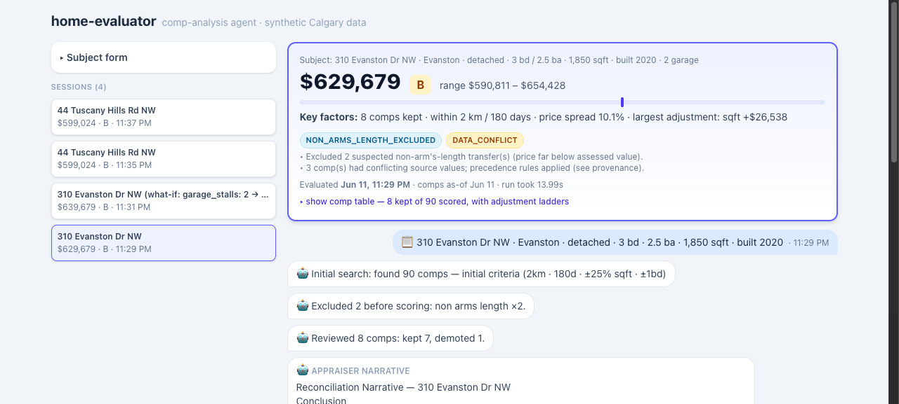
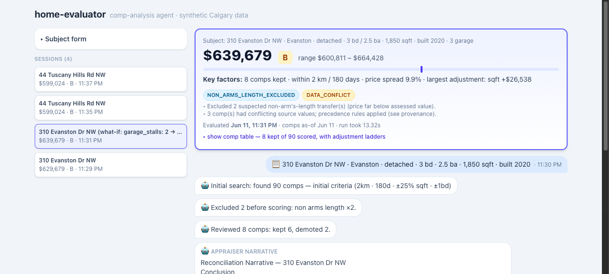

# home-evaluator — comp-analysis agent

An AI agent that does residential comp analysis the way a lender needs it done: it
searches multi-source sales data, ranks comparables with auditable math, reviews each
comp with LLM judgment, produces a valuation estimate with a confidence grade and risk
flags, and explains its reasoning appraiser-style — live, in a chat-style streaming UI
where each home is a session you can question afterward, and a "what if…" spawns a
fully audited re-evaluation with the field change shown as a diff.

Built for the KV Capital AI Engineer hackathon. **≤3-min demo video: _link goes here_.**

| Sessions, transcript + hero valuation | What-if re-run (garage 2 → 3) |
|---|---|
|  |  |
| **Normal market (Evanston)** | **Thin market (Bearspaw acreage)** |
|  |  |

## The problem

KV Capital underwrites loans to Alberta home builders; the bottleneck is comp analysis.
An analyst valuing a property searches three places by hand — MLS, land titles,
assessment rolls — three portals, three address formats, cross-referenced by eye. And
each source alone is incomplete: MLS misses private sales, land titles have no interior
attributes, assessments have no prices. Some signals are *only visible across sources* —
a non-arm's-length transfer is detected by comparing the land-titles price against the
assessed value.

Alberta sold prices are locked behind Pillar 9 and land titles (Calgary open data has no
sales and no interior attributes — verified). That data lock-up *is* the business
problem, so this prototype synthesizes a realistic Calgary world with a known
ground-truth price model — which also makes quality **measurable** instead of vibes
(see [Eval results](#eval-results)).

## The approach

Three stances drive every decision (full reasoning + complete decision log:
[`docs/deep-dive.md`](docs/deep-dive.md)):

- **As a product — the deliverable is a defensible number.** Estimate + range +
  confidence + risk flags, every dollar traceable to a named comp and a tested formula.
  Humans stay in the loop through typed, visible doors: the form is the input contract
  (extraction proposes, never feeds the engine), disagreement is argued via challenges
  (never clicked away), feedback is captured but never auto-applied.
- **As an agent — LLM judgment inside a code-gated action space.** A six-node LangGraph
  where the math is pure tested code and the LLM contributes judgment and language;
  per-node model selection (Haiku where volume, Sonnet where judgment); three
  integration modes used deliberately — tool-calling where the model chooses *actions*
  (widening), context injection where facts must *always* be present (chat grounding),
  typed JSON-to-code where anything *mutates results* (what-ifs, challenges).
- **As measurement — quality is proven, not vibed.** A synthetic world with a known
  ground-truth price model makes ranking and valuation quality measurable; ML and an
  AVM-style baseline calibrate and cross-check the explainable engine — they never
  replace it, and the eval is the arbiter of every retune.

## What's included

| Feature | The point | Where |
|---|---|---|
| Multi-source ingestion, field-level provenance, recorded conflicts | the business pain, demonstrated | `backend/data/` |
| Deterministic engine: filters → 8-dim similarity → adjustments → valuation, A/B/C confidence, risk-rule registry | every dollar traceable | `backend/engine/` |
| Agentic search widening from engine-projected move yields (≤2 rounds, reasons logged) | judgment, code-gated | `backend/agent/` |
| Per-comp LLM review (parallel fan-out, deterministic pre-checks, keep/demote/exclude) | auditable verdicts | `backend/agent/` |
| Streamed appraiser narrative (only numbers from the data block) | language, not arithmetic | `backend/agent/` |
| Paste-box extraction → form prefill, community inference constrained to known list | propose, never feed | `POST /api/extract` |
| Per-home sessions: background runs, done-badges, reload persistence | session = future DB schema | `frontend/src/sessions.ts` |
| Grounded follow-up chat (config-generated methodology + market stats; off-topic declined) | answers from constants, not vibes | `POST /api/ask` |
| What-if re-runs: code-computed diff → linked audited evaluation | no silent mutations | `POST /api/ask` |
| Comp challenge → re-review: claim as evidence → revise or defend, both logged | argued, not clicked | `POST /api/ask` |
| Feedback capture + diagnosis report (JSONL training lines, sliced deltas, names config knobs) | the underwriter loop | `POST /api/feedback` · `eval.feedback` |
| Eval vs ground truth + scenario asserts; hedonic calibration demo (R² 0.976) | provable quality | `eval.eval` · `eval.calibrate` |
| LangGraph Studio + LangSmith tracing support | every tool-call inspectable | `langgraph.json` |

## Architecture

```
                  ┌─ data layer (offline) ─────────────────────────┐
ground-truth model│ mls_sales.csv  land_titles.csv  assessments.csv │
                  └───────┬────────────┬───────────────┬────────────┘
                     adapters → canonical PropertyRecord → merge + provenance
                                      │  (comps.parquet)
                                      ▼
user form ──► FastAPI ──► LangGraph agent
               │            intake → search ⇄ widen → score → review ×8 → valuate → narrate
               │            (Haiku)  (code+Sonnet)    (code)  (Haiku ∥)    (code)    (Sonnet)
               ▼
           SSE stream ──► React/Vite single page: live timeline · comps · narrative
```

The compiled agent graph (drawn by LangGraph itself; dotted = conditional edges):


**Two clocks.** Data is acquired at *ingestion time* (offline batch; production would be
scheduled syncs of licensed feeds — never query-time scraping). The agent at *query
time* searches the local merged store in milliseconds.

**Three principles, enforced in code:**

1. **The LLM never produces a number the engine didn't compute.** Filtering, similarity
   scoring, adjustments, valuation, confidence, risk rules — all pure, deterministic,
   unit-tested Python (`backend/engine/`, no LLM imports). The LLM contributes judgment
   (search strategy, comp review, notes interpretation) and language (the narrative).
2. **LLM judgment operates inside a code-gated action space.** Search widening is
   genuine tool-calling — but the engine pre-computes what every move would find, never
   offers a capped move, and never offers "accept" when it would mean an empty result.
   The model chooses the trade-off; the engine guarantees the choice is sane.
3. **Graceful degradation.** Every LLM node has a deterministic fallback; a failed call
   degrades the result (marked in the UI), it never breaks the run.

### What a run looks like

- **intake** mines free-text notes into signals ("backs onto golf course", "unfinished
  basement") and flags contradictions — but never alters the form's numbers.
- **search** applies hard filters (type, radius, recency, size band, beds). If thin, the
  **widen** node asks the LLM to pick ONE move — extend days / widen radius / relax sqft
  / relax beds / accept — with engine-projected comp counts per move; its reason is
  logged verbatim in the audit trail. Capped at 2 rounds.
- **score** ranks candidates 0–100 across 8 weighted dimensions with a per-dimension
  breakdown the UI shows on hover.
- **review** fans out (parallel LLM workers, one per top-8 comp) with deterministic
  pre-checks: price/assessed ratio, source conflicts, quick-flip suspicion. Verdicts:
  keep / demote (half weight) / exclude — each with one-sentence reasoning shown as a
  chip in the UI.
- **valuate** time-adjusts via a community trend index, applies attribute adjustments
  (capped age, lot deadband, marginal $/sqft), takes the similarity-weighted median with
  a weighted P25–P75 range, grades confidence A/B/C, and evaluates the risk-rule
  registry: `THIN_COMPS`, `HIGH_DISPERSION`, `NON_ARMS_LENGTH_EXCLUDED`, `DATA_CONFLICT`,
  `EXTRAPOLATION`, `STALE_COMPS`, `WIDENED_SEARCH`, `BASELINE_DIVERGENCE` (estimate vs a
  median-$/sqft market-norm yardstick — the honest AVM stand-in; disagreement flags,
  never replaces).
- **narrate** streams an appraiser-style reconciliation under a hard rule: only numbers
  present in the data block.

And around the run, the UI:

- **Describe-the-home paste box** — paste a listing sentence or just an address
  ("88 9 St NE, Calgary, AB T2E 4E1, 3 bed 2.5 bath, built 1952…") and one extraction
  call prefills the form; the community resolves even for inner-city numbered streets
  (postal prefix + quadrant → Bridgeland), constrained to the dataset's communities and
  labeled "⚐ inferred — verify". Nothing auto-submits — the human confirms the form, so
  extraction can propose but never silently feed the engine. (Production: a geocoder
  replaces the inference call; the wiring doesn't change.)
- **Sessions** — every home is its own session (form on the left; the typed address
  auto-fills the community, and a mismatch is warned about in the form, cross-checked
  again by intake, and flagged in the transcript). Runs continue in the background —
  switch homes mid-evaluation and a green "done ●" badge marks results that finished
  while you were away; completed sessions survive a reload (localStorage).
- **Follow-up chat** — ask the finished evaluation questions ("why confidence B?");
  answers are grounded in that session's computed results only. A "what if it had a
  triple garage?" comes back as a field diff (`garage_stalls: 2 → 3`, computed in code,
  never trusted from the LLM) and spawns a linked session through the normal pipeline —
  every what-if is a full audited evaluation, never an LLM-adjusted number.
- **Comp challenges** — disagree with a comp ("comp 2 backs onto a highway") and the
  agent *re-reviews it with your claim as evidence*: it either revises (the engine
  re-reconciles; the card shows "⚖ challenge applied — revised from $X" with the
  original preserved) or defends its verdict — your objection stays in the record
  either way. The human supplies evidence; the agent judges; the engine computes.
- **Feedback on every valuation** — rate a finished evaluation (1–5★, optional comment +
  your own estimate) right under its valuation card; each label becomes a durable,
  self-contained training example. See the **Underwriter feedback loop** section below.

## How to run

```bash
# backend (Python 3.12 + uv) — from backend/
uv sync
cp .env.example .env                    # add ANTHROPIC_API_KEY (optional: LangSmith)
uv run uvicorn app.main:app --reload    # API on :8000; builds the dataset on first start

# frontend — from frontend/
npm install
npm run dev                             # UI on :5173 (proxies /api → :8000)

# extras — from backend/
uv run pytest                           # 124 tests
uv run python -m agent.run_demo        # CLI event stream on 3 demo subjects
uv run python -m eval.eval             # eval vs ground truth → eval/results.md
uv run python -m eval.calibrate        # hedonic fit vs engine rates → eval/calibration.md
uv run python -m data.generate --seed 42   # regenerate the synthetic world
uv run langgraph dev --port 2025       # LangGraph Studio: visual step-through of the graph
```

Without an API key the agent runs in deterministic fallback mode end-to-end (same
pipeline, no LLM judgment, empty narrative). Set `LANGSMITH_TRACING=true` to see every
run — including each widening tool-call — as a trace in LangSmith.

## The synthetic world

Seeded generator (`backend/data/generate.py`): 8 real Calgary communities with distinct
profiles, ~2,650 sales over 24 months, ~6,300 properties, real geometry (community
centroids + jitter, haversine radius search). Three differently-shaped source files
(realtor addresses vs legal descriptions vs assessment abbreviations, "3+1" bed
notation, private sales missing from MLS) merged into one canonical record with
**field-level provenance** and conflicts recorded — never silently resolved.

Planted edge cases the agent must handle (and is tested on):

| Case | What the agent does |
|---|---|
| Non-arm's-length transfers (land-titles only, ~60% of value) | detects via price/assessed < 0.75, excludes with reason, flags |
| Thin market (Bearspaw: 5 sales/24mo) | widens with logged reasoning, lower confidence |
| Luxury outlier variance (Aspen Woods) | wider range, dispersion flag |
| Quick flips (resold <6mo, +25%) | review pre-check + verdict |
| MLS price ≠ land titles (~5%) | land-titles precedence, `DATA_CONFLICT` flag |
| MLS year-built errors (~5%) | assessment precedence, conflict recorded |
| Stale pocket (no recent sales) | `STALE_COMPS` flag, time adjustment carries it |

## Eval results

20 held-out subjects priced by the ground-truth model, full agent with LLM on:

| Metric | LLM ON | Deterministic baseline |
|---|---|---|
| MAPE | **2.2%** | 2.1% |
| Median \|error\| | **1.4%** | 2.1% |
| Within ±10% | **20/20** | 19/19 (Bearspaw: no estimate) |
| Scenario asserts | all pass | all pass |

The notable row: the Bearspaw acreage. The deterministic widening order found nothing;
the LLM, choosing from engine-projected move yields, recovered 2 comps and estimated
within **+3.6%** of ground truth — graded C with four caveat flags. LLM judgment didn't
degrade accuracy; it recovered an estimate, with the caveats attached. Full table:
[`backend/eval/results.md`](backend/eval/results.md).

The eval also caught a real agent bug during development: the model once *accepted* an
empty comp set while a move provably yielded comps. That became the action-space
guardrail above — ground truth → scenario assert → caught regression → code-enforced fix.

## Underwriter feedback loop (in the repo — not shown in the demo video)

> The 3-minute video doesn't reach this feature; it lives here and in the session UI.

Every completed valuation can be rated in its session: a 5-level rating, a comment, and
an optional "your estimate $" (the highest-value signal for later calibration). The
rating persists on the session, and the strip fire-and-forgets one **self-contained**
JSON line to `backend/data/feedback.jsonl` — the valuation *as displayed at rating time*
(subject, estimate/range/confidence, comp ids + scores, risk flags) plus the human label,
so each line is a complete (input, output, label) training example.

```bash
uv run python -m eval.feedback   # → backend/eval/feedback_report.md
```

The report computes user-vs-engine deltas and rating slices by confidence grade,
community, and risk flag — n shown everywhere, "n < 10: directional only" caveat
attached — and its callouts name the `engine/config.py` knob to investigate. The
principle is the same one the LLM lives under: **feedback proposes, eval disposes.**
User feedback is a weak, biased label (anchoring, selection, owner optimism), so it
never moves a weight at runtime — capture (this feature) → diagnose (this report) →
`eval.calibrate` proposes rates → `eval.eval` validates against ground truth.

## Design decisions & trade-offs

As an **agent**:

- **Hybrid agent** over pure-LLM: a lender needs every dollar traceable to a named comp
  and a tested formula. The LLM judges; the engine computes.
- **No RAG/vector retrieval** for structured comps: exact predicates + auditable scoring
  beat cosine similarity for numeric attributes. Semantic re-ranking belongs later, over
  unstructured listing remarks, as an enrichment signal.
- **Stateless across runs** by design: valuations must be independent and reproducible
  (audit requirement). Learning happens offline, between versions.
- **Widening capped at 2 rounds**, every move capped — bounded cost, latency, and audit size.
- **Chat grounding by injection, not tools**: an uncalled tool silently skips grounding;
  injected context is structurally always present (flip condition in
  [What's next](#whats-next-designed-not-built)).

As a **product**:

- **Synthetic data with a ground-truth model** over scraping: real Alberta sold prices
  are inaccessible (that's the business problem); bonus is provable eval.
- **Form in, transcript out** over free-text chat intake: structured fields are the
  lender-grade input contract (a typo must never move a valuation); the per-home
  transcript + follow-up chat deliver the agent feel without a multi-turn intake loop.
- **Challenge → re-review** over a one-click comp override: a click that overrules the
  agent with no argument makes agent judgment decoration; a stated claim the agent
  weighs as evidence mirrors real appraisal review.
- **Precedence, recorded**: land-titles price > MLS (registered legal record);
  assessment year-built > realtor-entered MLS; disagreements become flags, not silent fixes.

The full decision log with rejected alternatives — grouped agent / product / data & ML /
process — lives in [`docs/deep-dive.md`](docs/deep-dive.md) §4; the raw chronological
log in [`docs/demo-notes.md`](docs/demo-notes.md).

## What I cut and why

- **Borrower/owner legal status, liens, credit** — a different underwriting step with
  different data; the risk-rule registry is the door it walks back in through.
- **Live data connectors** — hackathon scope; the production path is documented below
  and verified to exist.
- **Fuzzy entity resolution** — we control the synthetic mess; a normalized-exact
  address join is sufficient and unit-testable.
- **Self-improving loops / cross-run memory** — audit reproducibility first; offline
  feedback tuning later.
- **Commercial properties** — residential only.

## Production data plan

All three real channels exist and are batch-shaped — exactly the ingestion model this
repo implements; each becomes a `CompSource` adapter:

- **Calgary assessments** — free open data with a Socrata API, works today.
- **Alberta land titles** — Volume Data Access products: bulk, database-ready, standard
  paid contract.
- **Pillar 9 (MLS)** — RESO Web API under a negotiated data license; sold-data access is
  commercially gated but a well-trodden vendor path.

Three production notes the prototype's seams already anticipate: a **geocoder** turns
the subject address into lat/lon feeding the *existing* haversine distance filter (today
the search anchors at the community center — the address is display + cross-check only,
it can never move the number); **server-side run state** lets an in-flight evaluation
survive a browser refresh (finished sessions already do, via localStorage); and human
disagreement stays **challenge → agent re-review** in chat, with a formal sign-off step
(licensed reviewer, mandatory written justification) as the legal backstop — never a
button that silently bends the report.

## Extension points

1. New data source → implement the `CompSource` protocol; merge/provenance unchanged.
2. New risk factor → append a rule function to the registry (a test proves a lambda works).
3. Model swaps → per-node env vars (`INTAKE_MODEL`, `SEARCH_MODEL`, `REVIEW_MODEL`, `NARRATE_MODEL`).
4. Frontend swap → the SSE contract is the API; the React page is a thin renderer.
5. New pipeline stage → a LangGraph node (e.g., title-check between review and valuate).
6. Expert-editable methodology → prompts are files in `backend/agent/prompts/`; lending
   staff can revise the appraisal instructions without code changes.

ML roadmap: subscribe the trend index to a real HPI, fit adjustment coefficients by
hedonic regression on licensed solds, add an AVM-divergence risk rule, learn similarity
weights from the firm's own appraisal archive. Models calibrate and cross-check the
explainable engine — they never replace it. Two of these seams already run in this repo:
`eval/calibration.md` (hedonic fit recovering the per-factor rates, R² 0.98 — the same
code fits the real market on licensed data) and the `BASELINE_DIVERGENCE` rule (the
divergence wiring a production AVM would slot into).

## Time log

Built in ~10h of wall-clock human-involved time against a 12h cap — itemized per block
with plan-vs-actual in [`TIMELOG.md`](TIMELOG.md).

## What's next (designed, not built)

Nothing in this section exists in code yet — each item is deliberately deferred, with
its seam already in place (full roadmap with the ML ladder and hardening backlog:
[`docs/deep-dive.md`](docs/deep-dive.md) §5).

Server-side run persistence (in-flight runs surviving refresh) · the feedback loop's
last mile (the captured ratings driving offline weight/prompt retunes between versions —
capture and diagnosis already run in this repo, see the feedback-loop section above),
semantic enrichment over listing remarks, title-check stage, and the production
connectors above.

**Chat grounding graduates to a read-only retrieval tool layer.** Today the chat is
grounded by injection: the config-generated methodology block and all-community market
stats ride along in every `/api/ask` call — the right design while grounding is ~1.5k
tokens of constants plus eight stat rows, because injected context can't be silently
skipped the way an uncalled tool can. It flips when grounding outgrows the prompt:
comp-store queries ("every sale on this street"), handbook search, live HPI lookups
become read-only retrieval *tools* the model calls on demand (natural shape: an MCP
server over engine functions, reusable by any client). The division of labor is the
durable part: facts that must always be present stay injected (methodology) · the model
chooses retrievals (tools) · anything that mutates results stays a typed action executed
by audited code (what-ifs, comp challenges) — the guarantee lives in the handlers, not
the wire format, so the migration changes plumbing, never the trust boundary.

**Sessions move server-side with accounts.** Today's localStorage `Session` object is
already the schema — subject, run state, chat, timestamps, what-if lineage — so a
`sessions` table keyed by (account, session) takes it verbatim, and persistence is
isolated behind two functions in `sessions.ts` that become `GET/PUT /api/sessions`.
Accounts buy cross-device access, underwriters reviewing an analyst's session (the
challenge log as a review artifact), and provenance for the tuning loop. The valuation
endpoints stay stateless either way — the store sits beside the audit path, never
inside it — and server-stored sessions bring the usual lending-data obligations
(retention, access control, encryption at rest).

**Cross-session memory — only if demand shows up.** Conversational memory already
exists *within* a session (the chat keeps its full history; each question carries the
recent turns). What's deliberately absent is memory *across* sessions and runs: every
answer must be reproducible from that home's report alone. Two audit-compatible extensions if
users ask for them: an explicit *compare-two-sessions* command (the user selects both —
grounded in two auditable contexts, not implicit recall), and recurring challenge
patterns feeding the offline tuning loop above. Implicit cross-session memory stays
out — silent context is the enemy of a defensible number.

Confidence calibration: the A/B/C grades are heuristic cuts (comp count, IQR, similarity
floor in `engine/config.py`), not calibrated probabilities — eval case 5 carries an A grade
with the table's largest error (+7.9%). Calibrating the cuts against a larger eval set is
the obvious next step.
